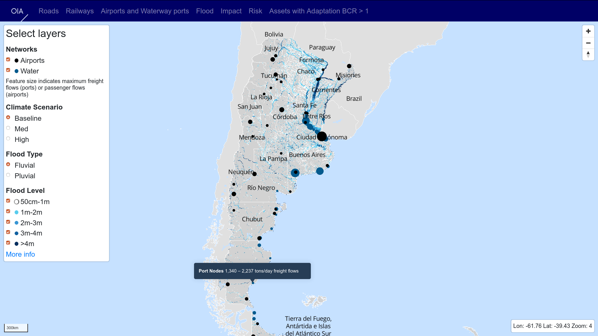
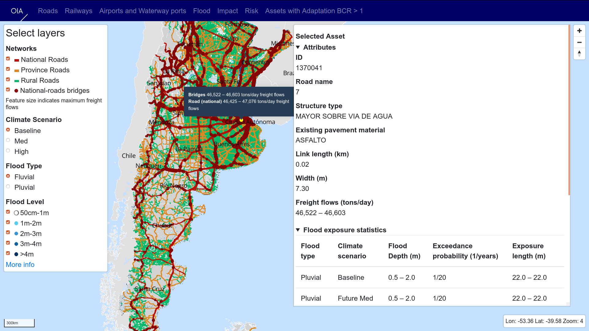
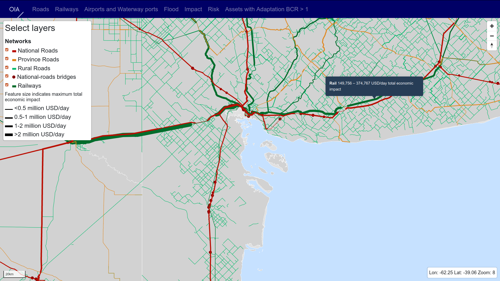
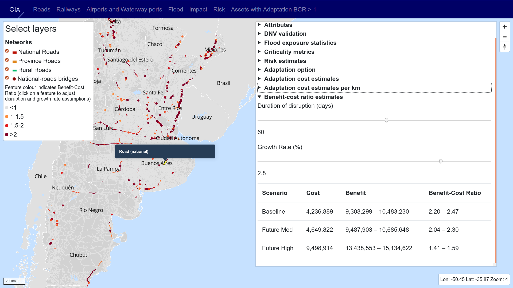

# OIA Risk Visualisation Tool

This project provides interactive data visualisations of OIA risk analysis results.

The tool presents the infrastructure systems and hazards considered in the analysis, then
presents results as modelled for the whole system at a fine scale.

Query attributes of elements of the system:

Range of potential economic impact of failure:

Cost-benefit analysis (under uncertainty, with options to explore some parameters) of
adaptation measures:

This README covers requirements and steps through how to prepare data for visualisation and how
to run the tool.

1. Data preparation requirements
2. Prepare data
3. Build and run requirements
4. Run

## Data preparation requirements

### ogr2ogr

[ogr2ogr](https://www.gdal.org/ogr2ogr.html) is used for spatial data processing. On Ubuntu,
run:

    sudo apt-get install gdal-bin

### Tippecanoe

The data preparation steps use [Mapbox tippecanoe](https://github.com/mapbox/tippecanoe) to
build vector tiles from large feature sets.

The easiest way to install tippecanoe on OSX is with Homebrew:

    brew install tippecanoe

On Ubuntu it will usually be easiest to build from the source repository:

    sudo apt-get install build-essential g++ libsqlite3-dev zlib1g-dev
    git clone https://github.com/mapbox/tippecanoe
    cd tippecanoe
    make -j
    make

## Prepare data

For Argentina (for example) download `boundaries`, `network` and `flood_data` `usage` `results` from the OIA
shared folder `302 Argentina/D Work Processes/Argentina/data/`.

Either link to the synced/downloaded data directories:

    ln -s 'path/to/OneDrive/Argentina/results' incoming_data/results

Or unzip within `/incoming_data` folder:

    unzip ~/Downloads/boundaries.zip -d incoming_data/
    unzip ~/Downloads/network.zip -d incoming_data/

Convert the incoming data to JSON files first:

    python scripts/files_to_json_for_vis.py

Create the *.mbtiles files for visualisation:

    make

Alternatively, download the prepared MBTiles files from `network_data_vis/Mbtiles_files` and
unzip directly in the `/data` folder.

## Build and run requirements

### Node and npm

The build and run steps use [node.js](https://nodejs.org/) - this provides the `npm` command.

Install required packages. Run from the project root:

    npm install

## Run

Running the application currently requires two (local) server processes: the tileserver and the
app itself.

### Run the tileserver

Run the tileserver directly (from the root of the project):

    npx tileserver-gl-light

Open a browser to view the tileserver:

    firefox http://localhost:8080/

### Run the app

Start the app server:

    npm start

This should automatically open a browser tab. If not, open:

    firefox http://localhost:3000/

## Deployment

To build and deploy the site:

- build the frontend
- provision a server
- configure the server
- upload frontend, data and config

`npm run build` builds the frontend for deployment. This puts HTML/CSS/JS in the build folder,
which can be served directly in production.

`provision.sh` contains installation instructions for an Ubuntu 18.04 server to install NGINX,
setup SSL using CertBot, install node and tileserver-gl-light

`config/` directory contains:

- nginx config to serve frontend assets directly and proxy tile  requests to the tileserver
- systemd service config to run the tileserver as a service

`deploy.sh` uploads the build directory, data and tileserver config to a server,
assuming that whoever runs the script has ssh/public key access.

After changing map styles (any of the `*.json` files under `styles`), the tileserver should be
restarted. Assuming that it has been setup as a systemd service, run:

    sudo service tileserver restart
