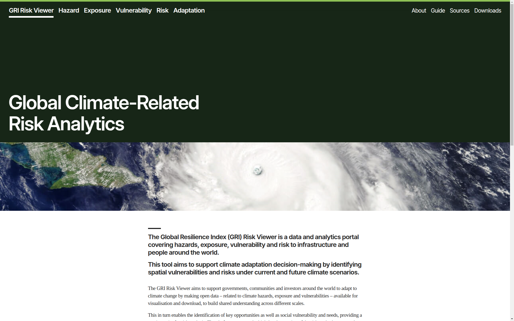

# Infrastructure Risk Visualisation Tool

This project provides interactive data visualisations of risk analysis results.

The tool presents the infrastructure systems and hazards considered in the
analysis, then presents results as modelled for the whole system at a fine
scale.

See an overview of infrastructure networks:

Other functionality planned (and incorporated in some way in previous versions):

- Summarise risk analysis at an administrative regional scale.
- Zoom in to see networks in detail.
- See an overview of hazard data.
- Inspect details of hazard layers.
- Query attributes of elements of the system.
- Range of potential economic impacts of failure, consisting of direct damages
  to infrastructure assets and indirect economic losses resulting from
  infrastructure service disruption (loss of power, loss of access).
- Explore a cost-benefit analysis (under uncertainty, with options to explore
  some parameters) of adaptation measures.

This README covers requirements and steps through how to prepare data for
visualisation and how to run the tool.

1. Data preparation requirements
2. Prepare data
3. Build and run requirements
4. Run

## Data preparation requirements

### GDAL tools

[ogr2ogr](https://www.gdal.org/ogr2ogr.html) and other GDAL programs are used for spatial data
processing. On Ubuntu, run:

    sudo apt-get install gdal-bin

### Tippecanoe

The data preparation steps use
[Mapbox tippecanoe](https://github.com/mapbox/tippecanoe) to build vector tiles
from large feature sets.

The easiest way to install tippecanoe on OSX is with Homebrew:

    brew install tippecanoe

On Ubuntu it will usually be easiest to build from the source repository:

    sudo apt-get install build-essential g++ libsqlite3-dev zlib1g-dev
    git clone https://github.com/mapbox/tippecanoe
    cd tippecanoe
    make -j
    make

### Prepare datasets for visualisation

The visualisation tool runs off MBTiles files which contain vector tiles of the
data to visualise.

> TODO update the documentation of this process

## Build and run requirements

### Node and npm

The build and run steps use [node.js](https://nodejs.org/) - this provides the
`npm` command.

Install required packages. Run from the project root:

    npm install

### Terracotta

Install the raster tileserver - Terracotta

Suggest installing using conda:

    conda create --name infrariskvis python=3.8 numpy rasterio shapely crick
    conda activate infrariskvis
    pip install terracotta[recommended]

## Run

Running the application currently requires three (local) server processes: the
vector and raster tileservers, and the app itself.

### Run the vector tileserver

Run the tileserver directly (from the root of the project):

    npm run vector

### Run the raster tileserver

Prepare the raster tileserver database:

    npm run raster-init

Run the raster tileserver:

    npm run raster

### Run the app

Start the app server:

    npm start

This should automatically open a browser tab. If not, open:

    firefox http://localhost:3000/

## Deployment

See `./deploy` directory.

## Acknowledgements

This tool has been developed through several projects.

- [v0.1](https://github.com/oi-analytics/oi-risk-vis/releases/tag/v0.1-argentina)
  was developed by Oxford Infrastructure Analytics for the Government of
  Argentina with funding support from the World Bank Group and Global Facility
  for Disaster Reduction and Recovery (GFDRR).
- [v0.2](https://github.com/oi-analytics/oi-risk-vis/releases/tag/v0.2.0-seasia)
  was developed by Oxford Infrastructure Analytics for the Disaster Risk
  Financing and Insurance Program (DRFIP) of the World Bank with support from
  the Japan—World Bank Program for Mainstreaming DRM in Developing
  Countries, which is financed by the Government of Japan and managed by the
  Global Facility for Disaster Reduction and Recovery (GFDRR) through the Tokyo
  Disaster Risk Management Hub.
- current development is by the Oxford Programme for Sustainable Infrastructure
  Systems in the Environmental Change Institute, University of Oxford, for the
  Government of Jamaica (GoJ) as part of a project funded by UK Aid (FCDO). The
  initiative forms part of the Coalition for Climate Resilient Investment’s
  (CCRI) collaboration with the GoJ, which also includes analysis of
  nature-based approaches to build resilience in Jamaica to be procured and
  funded by the Green Climate Fund (GCF).
